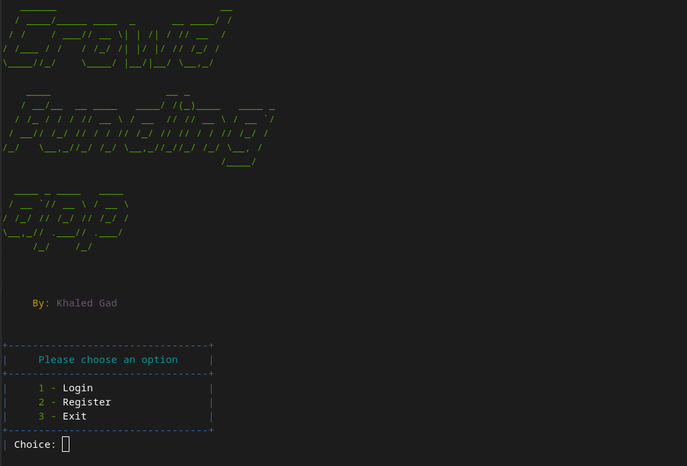
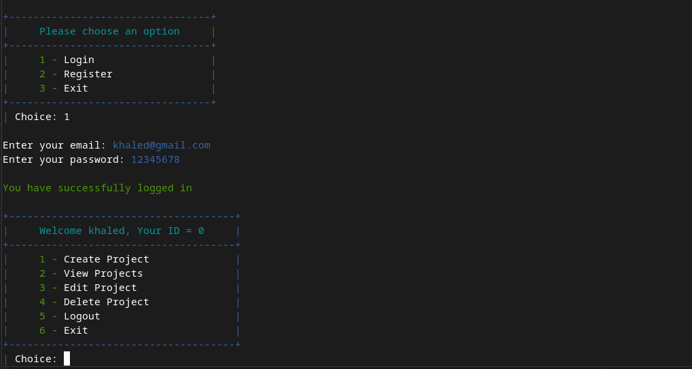
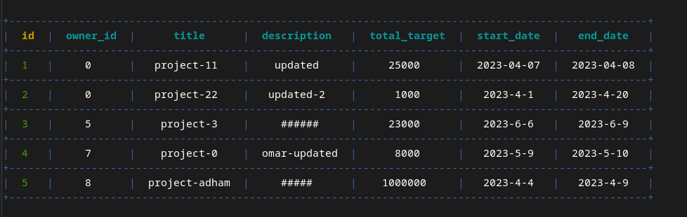

# Crowd Funding App

## Video Demo
<!-- 
<br>
<div align="center"> -->
https://raw.githubusercontent.com/khgad/crowd-funding-app/main/screenshots/crowd-funding-app-audio.mp4

<!-- </div>
<br> -->

## Overview

The Crowd-Funding Console App is a Python-based console application designed to make fundraising easy for users. With this app, users can create and manage crowdfunding projects without the need for a complicated web platform or a dedicated IT team.

## Features

The app includes the following features:

### Authentication System

The app has an authentication system that allows users to register with their first name, last name, email, password, confirm password, and mobile phone number (validated against Egyptian phone numbers). Once registered, users can log in using their email and password.

### Projects

The app's key feature is the ability for users to create crowdfunding campaigns. These campaigns can have a title, details, total target amount, and a start and end date for the campaign. The app also validates the date formula to ensure accuracy.

In addition to creating campaigns, users can view all projects, edit their own projects, and delete their own projects.

### Scripts

The app also includes scripts that print projects and options in a clean and easy-to-read format, making it easier for users to navigate the app.


<p align="center">
    
    <i>Start of the project</i>
</p>
<br>
<p align="center">
    
    <i>Login process</i>
</p>
<br>
<p align="center">
    
    <i>table of projects</i>
</p>
<!--  -->
<!--  -->
<!--  -->

## Installation

To install and use the Crowd-Funding Console App, follow these steps:

1. Clone the repository to your local machine.

``` bash
git clone https://github.com/khgad/crowd-funding-app.git
```

2. Run the app by executing the following command in your terminal:

``` bash
python main.py
```

## Conclusion

The Crowd-Funding Console App makes fundraising accessible to everyone. With its user-friendly interface and powerful features, users can create and manage crowdfunding campaigns with ease. I hope you to find this project useful for you!

## Author

[Khaled Gad](https://www.linkedin.com/in/khgad/)
